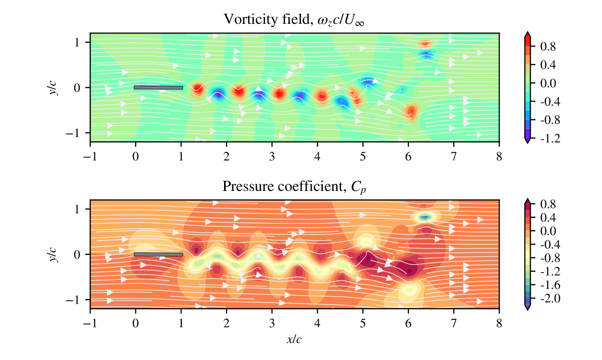
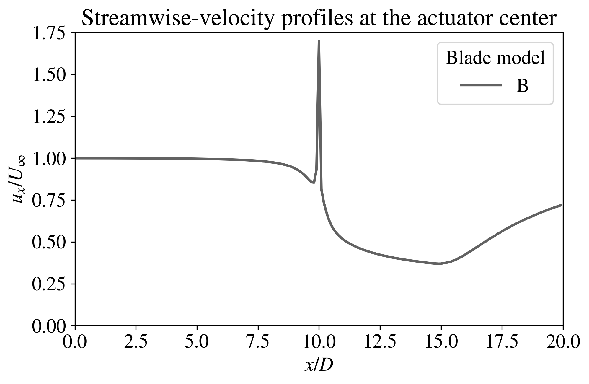
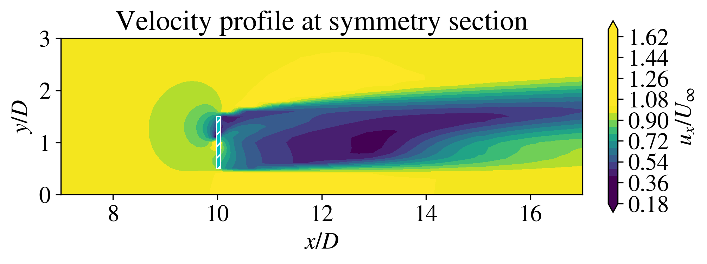
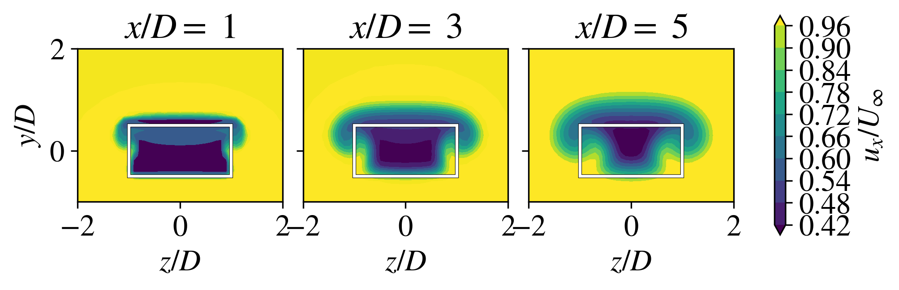

# pyFoamPP
 
Welcome to the `Python-Foam-Post-Processing (pyFoamPP)` repository! This project provides a comprehensive framework to convert and manipulate OpenFOM solutions (case files) into Python's Numpy arrays.

## Table of Contents

- [Project Overview](#project-overview)
- [Features](#features)
- [Installation](#installation)
- [Examples](#Examples)
- [Contributions](#contributions)
- [License](#license)

## Project Overview

In this project, we extend the [fluidFoam](https://fluidfoam.readthedocs.io/en/latest/) project to account for non-structured [OpenFOAM](https://www.openfoam.com/) mesh files. Here, we adopt a fast Radial basis function (RBF) interpolation algorithm that converts non-structured OpenFOAM grid files into structured, 3-dimensional grids of homogeneous gridding spacing. 

The 3-dimensional grids are stored in user-friendly 3-dimensional Numpy arrays and are automatically backed up into compressed files for future use.


<p align="center">

</p>


## Features

- **Loading files**: We adopt [fluidFoam](https://fluidfoam.readthedocs.io/en/latest/)'s framework for reading OpenFOAM's backup data and converting it into point data.
- **Data interpolation**: We use a Radial basis function (RBF) interpolation algorithm to efficiently convert any input OpenFOAM grid file into 3-dimensional, homogeneously-seeded grids stored as Numpy arrays.
- **Data interpolation**: The project includes tools and examples for analyzing the resulting (interpolated) numerical data related to aerodynamics, helping us draw insights from real-world tests.


## Installation

1. Clone the repository using: `git clone https://github.com/MyFlavioMartins/pyFoamPP.git`
2. Navigate to the project directory: `cd pyFoamPP`
3. Install the required dependencies: `pip install -r requirements.txt`

## Examples


1. Plot the $u_x$-velocity profile along the $x$-axis


```python
fig, ax = plt.subplots()

mesh = loadMesh('mybackupfilename')
X = mesh.X
Y = mesh.Y
Z = mesh.Z
P = mesh.P
Ux = mesh.Ux

yindex = abs(mesh.y-1).argmin() 
zindex = abs(mesh.z-10).argmin() 

xline = X[:, yindex, zindex]
uline = Ux[:, yindex, zindex] / Uinf

ax.plot(xline, uline, linestyle[0], linewidth=2, color=myColors[0], label = casedescrip)

```

Output:

<p align="center">

</p>


2. Plot the $u_x$-velocity component onto the (crossflow) $yz$-plane:


```pyhon
fig, ax = plt.subplots()

ax.set_title('Velocity profile at symmetry section')

mesh = loadMesh('mybackupfilename')
X = mesh.X
nx, ny, nz = X.shape

ucontour = ax.contourf(mesh.X[:, :, nz//2], 
                       mesh.Y[:, :, nz//2], 
                       mesh.Ux[:, :, nz//2]/Uinf, 
                       extend='both', levels=30, vmin=0.4, vmax=1.0)

## Create a Rectangle patch
rect1 = patches.Rectangle((9.98, 0.5), 0.08, 1.0, linewidth=0.5, edgecolor='w', hatch='///', zorder=2, fc='c')
ax.add_patch(rect1)

cbar = fig.colorbar(ucontour, ax=ax, pad=0.04, shrink=0.4)
cbar.set_label(r'$u_x/U_{\infty}$')

ax.set_xlabel(r'$x/D$')
ax.set_ylabel(r'$y/D$')
ax.set(xlim=(7,17), ylim=(0,3))
ax.set_aspect(1)
```

<p align="center">

</p>


3. Plot the velocity field at different (downwind) $x$-coordinates:

```python
## Get the indexes in the grid where x=xcoord
xcoords = [11,13,15]
indexes = findNearest(mesh.x, xcoords) # plot fields at x[indexes]-locations

fig, axs = plt.subplots(1,len(indexes), figsize=(20*cm2in, 9*cm2in), dpi=120)

mesh = loadMesh(filenames)

for i, index in enumerate(indexes):   

      ucontour = axs[i].contourf(mesh.Z[index, :, :]-10, 
                                    mesh.Y[index, :, :]-1, 
                                    mesh.Ux[index, :, :]/Uinf,
                                    extend='both', levels=10, vmin=0.4, vmax=1.0)
      axs[i].set_aspect(1)
      axs[i].set_xlabel(r'$z/D$')
      axs[i].set_ylabel(r'$y/D$')
      axs[i].set(xlim=(-2,2), ylim=(-1,2))
      axs[i].set_title( r'$x/D=$ %0.0f' % (xcoords[i]-10) )

      ## Create a rectangular patch:
      rect1 = patches.Rectangle((-1, -0.5), 2, 1, linewidth=2.0, edgecolor='black', facecolor='none') 
      axs[i].add_patch(rect1)

cbar = fig.colorbar(ucontour, ax=axs, pad=0.05, shrink=0.6)
cbar.set_label(r'$u_x/U_{\infty}$')
```

Output:


<p align="center">

</p>

## Contributions

Contributions are welcome and encouraged! If you have ideas for improving or adding new analysis tools, or enhancing educational resources, feel free to fork this repository and create a pull request. Please ensure your changes align with the project's goals.

## License

This project is licensed under the [MIT License](LICENSE). You're free to use, modify, and distribute the code as long as you include the original license in your distribution.

---

Happy exploring the world of aerodynamics! If you have any questions or suggestions, please don't hesitate to reach out to us.
